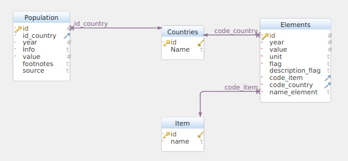
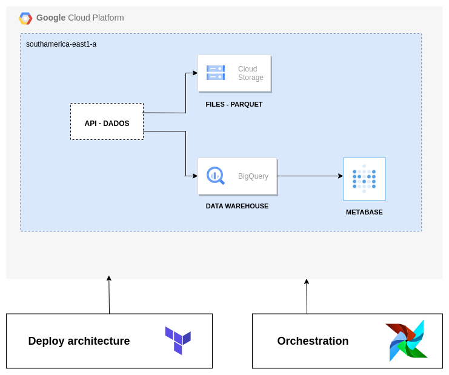
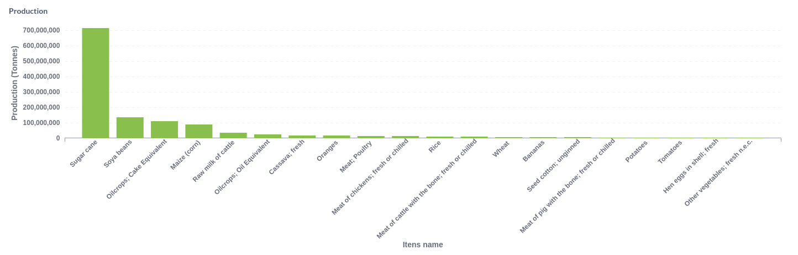
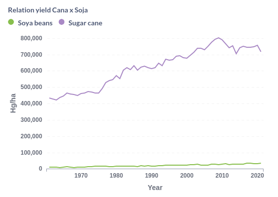

# Projeto Agro

## Objetivos
- Avaliar relação quantidade produzida de determinada commoditie por país.
- Avaliar o percentual colhido (Área plantada/Quantidade Colhida) de determinada commoditie por safra
- Avaliar percentual exportado (Quantidade exportado/ Quantidade colhida) em determinado país por anos
- Visualizar relação das commodities com o PIB de determinado país conforme o passar dos anos

## Datasets brutos
### Fonte: FAOSTAT

####  Crops and livestock products
- Domain Code : Código do dataset
- Domain : Nome dataset
- Area Code (M49): Código do país pelo padrão M49
- Area: País
- Element Code: Código do elemento
- Element: Elemento
- Item Code (CPC): Código do item
- Item: Nome do item
- Year Code: Código do ano
- Year: Ano
- Unit: Unidade de medida
- Value: Valor
- Flag: Flag(A,E,I,M,T)
- Flag Description: Descrição do que é a flag

### FONTE: ONU
-  Region/Country/Area: Código da região ou país
- Country: Nome do país ou região
- Year: Ano
- Series: Informação do valor
- Value: Valor
- Footnotes: Observações
- Source: Fonte do dado

## Modelagem banco de dados (Data Warehouse)
Para realizar a modelagem de dados foi utilizado o aplicativo DbSchema. O banco modelado encontra-se abaixo:

## Arquitetura do projeto
A fim de viabilizar o desenvolvimento do projeto, fez-se necessário instanciar os recursos que foram utilizados do GCP. Para isso,
utilizou-se a ferramenta *Terraform* que provisiona os recursos via código facilitando na manutenção e implementação
da infraestrutura.

A partir deste momento, inicia-se a criação do ETL. Dessa forma, o dado foi extraído das APIs disponibilizadas
pelas fontes citadas, e em seguida o mesmo foi tratado e a inserção é realizada em formato *.parquet* no *Cloud Storage* e dentro das tabelas do *Data Warehouse*.

Para análise desses dados foi utilizado a ferramenta *Metabase*.

Todo esse fluxo de desenvolvimento está representado pelo diagrama abaixo.

## Dashboards
Os dados mostrados através de gráficos podem ser visto dentro das dashboards montadas utilizando a ferramenta metabase.
Para acessar o metabase basta subir o docker-compose que já iniciará serviço. Após, acesse a url "localhost:3000" e quando solicitado
login insira como email "angelo.spinardi12@gmail.com" e senha "b?RdvP_aJ2NbP4". Lá dentro se encontra as pastas "Análises Brasil"
 e "Análises mundo".

Alguns gráficos gerados pelo metabase para análise do Brasil foram sobre as 20 commodities mais produzidas no Brasil em toneladas no ano de 2021
e também a relação da quantidade colhida em hg por alqueire das commodities mais colhidas no Brasil, Cana de açucar e Soja.
Outras análises podem ser visualizadas na dashboard acessando "localhost:3000/dashboard/2-dashboard-brazil".

