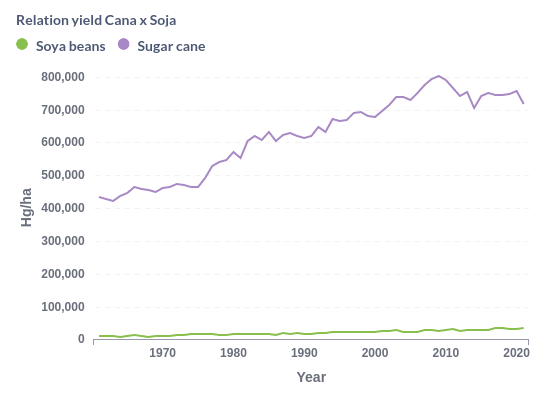

# Agro Project

## Objectives
- Evaluate the quantity produced of a certain commodity per country.
- Evaluate the harvested percentage (Planted Area/Harvested Quantity) of a certain commodity per season.
- Evaluate the exported percentage (Exported Quantity/Harvested Quantity) of a certain commodity in a certain country over the years.
- Visualize the relationship of commodities with the GDP of a certain country over time.

## Raw datasets
### SOURCE: FAOSTAT

####  Crops and livestock products
- Domain Code: Dataset code
- Domain: Dataset name
- Area Code (M49): Country code according to the M49 standard
- Area: Country
- Element Code: Element code
- Element: Element
- Item Code (CPC): Item code
- Item: Item name
- Year Code: Year code
- Year: Year
- Unit: Unit of measurement
- Value: Value
- Flag: Flag (A, E, I, M, T)
- Flag Description: Description of what the flag represents.

### SOURCE: ONU
- Region/Country/Area: Region or country code
- Country: Country or region name
- Year: Year
- Series: Information on the value
- Value: Value
- Footnotes: Observations
- Source: Data source

## Data Modeling (Data Warehouse)
To perform the data modeling, the DbSchema application was used. The modeled database is shown below:

## Project architecture
In order to make the project development possible, it was necessary to instantiate the resources used from GCP.
For this, the *Terraform* tool was used to provision resources via code, making it easier to maintain and implement
infrastructure.

From this point on, the ETL creation begins. Thus, the data was extracted from the APIs provided by the mentioned sources,
and then it was processed and inserted in *.parquet* format in *Cloud Storage* and within the tables of the *Data Warehouse*.

For data analysis, the *Metabase* tool was used.

This entire development flow is represented by the diagram below.

## Dashboards
The data shown through graphs can be viewed within the dashboards set up using the Metabase tool.
To access Metabase, just run the docker-compose file, which will start the service. Then, access the URL "localhost:3000" and when prompted for login, enter the email "angelo.spinardi12@gmail.com" and password "b?RdvP_aJ2NbP4". Inside there are the folders "Análises Brasil" and "Análises mundo".

Some charts generated by Metabase for Brazil analysis were about the 20 most produced commodities in Brazil in tons in 2021, and also the relationship of the harvested quantity in hg per acre of the most harvested commodities in Brazil, Sugarcane and Soybeans.
Other analyses can be viewed on the dashboard by accessing "localhost:3000/dashboard/2-dashboard-brazil".

